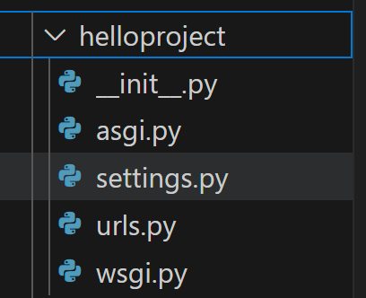

# Introduction à Django

Étiquettes: Python

# I] Introduction :

## 1) C’est quoi Django ?

Django, qui se prononce « jango », est un framework open source gratuit qui a été publié pour la première fois en 2005. Django tire son nom du célèbre guitariste de jazz Django Reinhardt. Parmi les nombreux frameworks Python qui ont été développés au fil du temps, Django est devenu l’un des plus connus en raison de la flexibilité et de la sécurité qu’il offre.

Django convient aussi bien pour le développement web front-end que back-end. Les bibliothèques Python intégrées rendent le développement plus simple et plus rapide. Django est aujourd’hui largement utilisé dans divers secteurs d’activité. Du fait de la popularité croissante de Django, les fournisseurs sont de plus en plus enclins à prendre en charge les applications Django sur leurs plateformes.

## 2) Types d’applications :

- Apprentissage automatique
- Plateformes d’e-commerce
- Analyse des données
- Gestion de contenu

## 3) Différences avec Flask :

| Django | Flask |
| --- | --- |
| Framework de pile complète | Framework web léger |
| Idéal pour des application basées sur des données | Idéal pour des API et services existants |
| Courbe d’apprentissage potentiellement plus forte | Courbe d’apprentissage potentiellement plus faible |
| Sécurité intégrée | Bibliothèque supplémentaire requises pour la sécurisation |
| Moteur de templating  HTML personnalisé | Moteur de templating Jinja |

# II] Installer Django :

Une fois dans le dossier du projet, nous allons créer et activer l’environnement virtuel.

Un environnement virtuel en Python est un outil qui permet d'isoler un projet Python des autres projets en créant un environnement dédié pour ce projet. Cet environnement contient sa propre installation de Python, ses propres bibliothèques et ses propres variables d'environnement, ce qui permet d'éviter les conflits entre les différentes versions de bibliothèques et les différentes configurations nécessaires pour chaque projet.

L'utilisation d'un environnement virtuel est recommandée pour le développement de projets Python, car elle permet de garantir que le projet fonctionnera correctement dans un environnement contrôlé, sans interférence avec d'autres projets ou bibliothèques installées sur le système. Elle facilite également le partage du projet avec d'autres développeurs, car ils peuvent facilement recréer l'environnement virtuel et installer les dépendances nécessaires.

Pour ce faire :

```bash
# Windows
python -m venv venv
.\\venv\\Scripts\\Activate

# macOS or Linux
python3 -m venv venv
source ./venv/bin/activate
```

Le nom de l’environnement virtuel est mis entre parenthèses et est suivi du chemin où vous êtes actuellement. À partir de cette invite de commandes, vous allez maintenant installer le framework Django.

Nous allons maintenant passer à l’installation du framework.

Pour ce faire, nous allons créer le fichier `requirements.txt` qui va lister les packages dont notre application a besoin :

```
Django
```

Puis nous allons installer les dépendances indiqués dans le fichier via la commande suivante :

```bash
pip install -r requirements.txt
```

# III] Explorer les concepts de base de Django :

## 1) Différences entre un projet et une application :

| Project | Application |
| --- | --- |
| Il ne peut y avoir qu’un seul projet | Il peut y avoir de nombreuses applications dans le même projet |
| Contient les paramètres ou applications nécessaires pour un site web spécifique | Est l’un des composants du site web global |
| Les projets ne sont pas utilisés dans d’autres projets | Les applications peuvent être utilisées dans de multiples projets. |

## 2) Les vues :

Les vues sont un autre composant des application Django. Elles assurent une fonction spécifique au sein de chaque application. Les vues contiennent tout le code qu’il faut pour retourner une réponse spécifique à une demande, par exemple : un modèle ou une image.

Elles peuvent même rediriger vers une autre page si la demande ne suit pas la logique requise dans la fonction.

## 3) Mappage d’URL :

Le mappage d’URL est appelé `URLconf` et sert de table des matières pour notre application. Quand il reçoit une demande d’URL, ce module recherche le lien approprié dans le projet, puis redirige la demande vers le fichier de vues contenu dans l’application. La vue traite ensuite la demande et effectue les opérations nécessaires.

# IV] Création de notre premier projet :

## 1) Création d’un projet avec django-admin :

```bash
django-admin startproject helloproject .
```



- **`helloproject`** est considéré comme le package Python de votre projet.
- **`init.py`** est un fichier vide qui sert à indiquer à Python que ce répertoire doit être considéré comme un package.
- **`settings.py**` contient l’ensemble de vos paramètres ou configurations.
- **`urls.py**` contient les URL incluses dans le projet.
- **`asgi.py`** et **`wsgi.py`** servent de point d’entrée pour vos serveurs web en fonction du type de serveur déployé.

## 2) Exécuter le projet :

Nous avons installé Django, créé un projet et examiné la structure du
 projet. Il est temps de vérifier que ce projet fonctionne correctement.

1. Dans la fenêtre de **terminal** dans Visual Studio Code, entrez le code suivant pour démarrer le serveur.

```bash
python manage.py runserver
```

Le projet effectue plusieurs vérifications système, puis démarre 
votre serveur de développement. Copiez et collez l’URL de votre serveur 
de développement (http://localhost:8000, normalement) dans votre 
navigateur habituel. Vous devez voir une page **Félicitations** dans Django, avec l’image d’une fusée qui décolle.

Arrêtez temporairement le serveur, car nous devons reconfigurer notre projet. Dans la fenêtre de **terminal**, sélectionnez **Ctrl+C**.

→ http://localhost:8000/


## 3) Création d’une application Hello World :

### A) Création de l’application :

```bash
python manage.py startapp hello_world
```


### B) Inscrire l’application auprès du projet :

Vu que les projets et les applications sont séparés dans Django, nous devons inscrire notre application auprès du projet. Pour ce faire, il faut mettre à jour la variable `INSTALLED_APPS` à l’intérieur du fichier [`settings.py`](http://settings.py) du projet (helloproject), en ajoutant une référence à la classe de configuration de l’application. La classe de configuration se trouve dans [apps.py](http://apps.py) de l’application hello_world eta le même nom que le projet.

<aside>
💡 Dans notre exemple, la classe est nommée `HelloWorldConfig`

</aside>


# V] Comprendre les chemins et les vues :

## 1) Les chemins :

### A) Ca sert à quoi ?

Toutes les applications permettent aux utilisateurs d’exécuter différentes méthodes ou fonctions par le biais de certains mécanismes. Cette action peut être l’appui sur un boutton dans une application mobile ou l’exécution d’une commande à partir de la ligne de commande.

Dans une application web, les demandes utilisateurs sont effectués par ces méthodes :

- Navigation vers différents URL ;
- Saisie d’informations ;
- Sélection d’un lien ;
- Appui sur un boutton.

Une route indique à Django quelle fonction utiliser si l’utilisateur effectue une demande pour une URL ou un chemin spécifique.

Par exemple, l’URL `https://adventure-works.com/about` peut exécuter une fonction appelée **about**. L’URL `https://adventure-works.com/login` peut exécuter une fonction appelée **authenticate**.

L’inscription des chemins dans Django se fait en configurant `urlpatterns`.
 Ces modèles indiquent à Django ce qu’il doit rechercher dans l’URL 
demandée par l’utilisateur, et ils déterminent la fonction à exécuter 
par la demande. Ces modèles sont regroupés dans un module Django appelé `URLconf`.

### B) Comment on fait ?

Se fait une fois que la vue est en place, nous allons maintenant mapper les vues aux bons urls.

Pour se faire nous allons aller dans le fichier [urls.py](http://urls.py) de notre application :

```python
from django.urls import path
from . import views

urlpatterns = [
    path('', views.index, name="index")
]
```

## 2) Les vues :

### A) Ca sert à quoi ?

Les vues déterminent les informations à retourner à l’utilisateur. Ce sont des fonctions ou des classes qui exécutent du code en réponse à la demande utilisateur. Elles retournent des réponses HTML ou d’autres types de réponses, par exemple, une erreur 404.

### B) Comment on fait ?

Dans le fichier [views.py](http://views.py) de notre application :

```python
from django.http import HttpResponse

def index(request):
	return HttpResponse("Hello World !")
```

## 3) Inscription des URLconf dans le projet

Notre nouveau `URLconf` se trouve dans l’application (`hello_world`). Etant donné que le projet contrôle toutes les demandes utilisateur, nous devons inscrire `URLconf` dans le fichier [urls.py](http://urls.py) principal, qui se trouve dans `helloproject`.

```python
from django.contrib import admin
from django.urls import include, path

urlpatterns = [
    path('', include('hello_world.urls')),
    path('admin/', admin.site.urls),
]
```

Une fois fait, nous allons exécuter l’application :

```python
python manage.py runserver
```


# Bibliographie :

https://learn.microsoft.com/fr-fr/training/modules/django-get-started/5-exercise-first-project

https://realpython.com/tutorials/django/